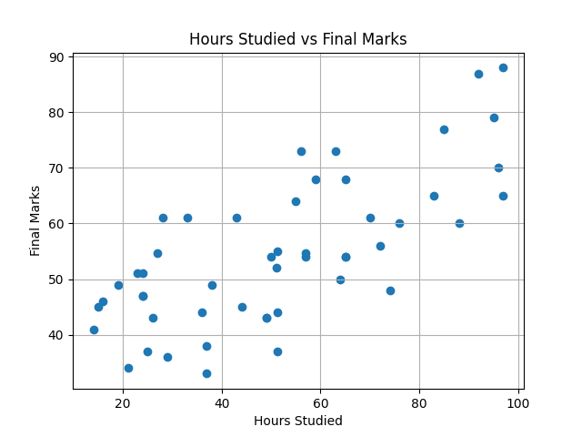
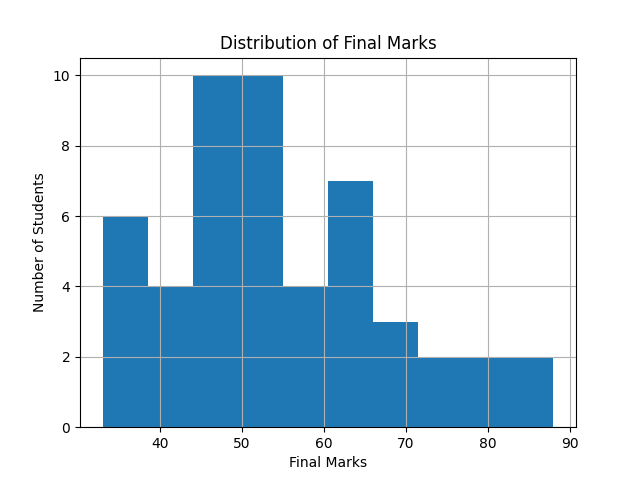

# Student Performance Predictor

## Overview

This project predicts student final marks using Machine Learning. The model analyzes study hours, attendance, and previous marks to estimate final academic performance.

## Features Used

- Hours Studied
- Attendance
- Previous Marks

## Target Variable

- Final Marks

## Technologies Used

- Python
- Pandas
- NumPy
- Scikit-learn
- Matplotlib

## Data Preprocessing

- Handled missing values using mean imputation
- Selected relevant features for prediction
- Split data into training and testing datasets
- Prepared data for model training and evaluation

## Machine Learning Model

- Linear Regression

## Evaluation Metrics

- MAE (Mean Absolute Error): 3.77
- MSE (Mean Squared Error): 18.49
- RMSE (Root Mean Squared Error): 4.30

## Results

The model predicts student performance with an average error of approximately 4 marks. The results demonstrate that study hours, attendance, and previous marks can be used to estimate final academic performance with reasonable accuracy.

## Project Structure

- student_data.csv
- student_predictor.py
- predictions.csv
- scatter_plot.png
- histogram.png
- README.md

## Visualizations

### Scatter Plot

### Histogram

## Future Improvements

- Increase dataset size for better generalization
- Experiment with additional features such as assignment scores and participation
- Compare Linear Regression with other machine learning algorithms
- Deploy the model using a web application framework such as Flask or Streamlit

## Author

Navakanth
